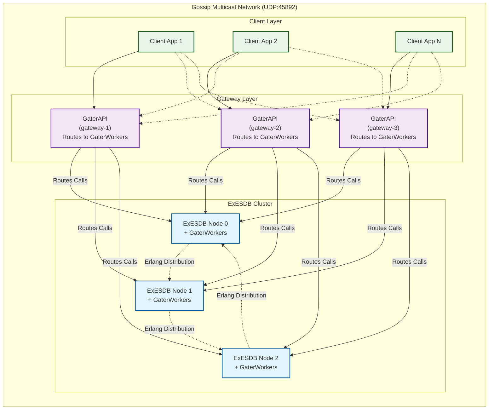

# ExESDB Gater

The ExESDB Gateway API

## Features

ExESDB Gater is a high-availability gateway service that provides secure, load-balanced access to ExESDB clusters. It acts as a proxy layer between client applications and the ExESDB event store cluster, offering simplified API access and automatic cluster discovery.

### Core Functionality

#### Event Store Operations

- **Stream Management**: Create, read, and manage event streams
- **Event Appending**: Append events to streams with version control
- **Event Retrieval**: Query events from streams with support for forward/backward traversal
- **Stream Versioning**: Get and track stream versions for optimistic concurrency control

#### Subscription Management

- **Multiple Subscription Types**:
  - `:by_stream` - Subscribe to specific streams
  - `:by_event_type` - Subscribe to events by type
  - `:by_event_pattern` - Subscribe using pattern matching
  - `:by_event_payload` - Subscribe based on event payload content
- **Persistent Subscriptions**: Durable subscriptions that survive restarts
- **Transient Subscriptions**: Temporary subscriptions for short-lived operations
- **Event Acknowledgment**: ACK/NACK support for reliable event processing
- **Replay Capability**: Start subscriptions from any stream version

#### Snapshot Management

- **Snapshot Recording**: Store aggregate snapshots for performance optimization
- **Snapshot Retrieval**: Read snapshots by source UUID, stream UUID, and version
- **Snapshot Deletion**: Remove outdated snapshots
- **Snapshot Listing**: Query available snapshots with filtering

### Cluster Discovery & High Availability

#### LibCluster Integration

ExESDB Gater uses LibCluster for automatic cluster discovery and formation:

- **Strategy**: Gossip-based multicast discovery
- **Protocol**: UDP multicast on configurable port (default: 45892)
- **Network**: Automatic discovery on shared Docker networks
- **Security**: Shared secret authentication for cluster joining
- **Broadcast Address**: Configurable multicast address (default: 255.255.255.255)

#### Cluster Formation Process

1. **Bootstrap**: ExESDB Gater starts and initializes LibCluster
2. **Discovery**: Uses gossip multicast to discover ExESDB nodes
3. **Authentication**: Validates cluster membership using shared secrets
4. **Connection**: Establishes Erlang distribution connections to cluster nodes
5. **Monitoring**: Continuously monitors cluster health and node availability

#### High Availability Features

- **Load Balancing**: Automatically distributes requests across available gateway workers
- **Failover**: Seamless handling of node failures and network partitions
- **Health Monitoring**: Real-time cluster status monitoring with detailed logging
- **Auto-Recovery**: Automatic reconnection to recovered cluster nodes
- **Split-Brain Prevention**: Coordinated cluster formation to prevent inconsistencies

### Configuration

#### Environment Variables

- `EX_ESDB_PUB_SUB`: PubSub process name (default: :ex_esdb_pubsub)
- `EX_ESDB_CLUSTER_SECRET`: Shared secret for cluster authentication
- `EX_ESDB_COOKIE`: Erlang distribution cookie
- `RELEASE_COOKIE`: Release-specific distribution cookie

#### LibCluster Configuration

```elixir
config :libcluster,
  topologies: [
    ex_esdb_gater: [
      strategy: Cluster.Strategy.Gossip,
      config: [
        port: 45_892,
        if_addr: "0.0.0.0",
        multicast_addr: "255.255.255.255",
        broadcast_only: true,
        secret: System.get_env("EX_ESDB_CLUSTER_SECRET")
      ]
    ]
  ]
```

### Dashboard & Monitoring

#### Web Dashboard

ExESDBGater includes composable dashboard components for real-time cluster monitoring:

- **Real-time Updates**: Live cluster state updates via Phoenix.PubSub
- **Node Monitoring**: Track node connectivity, health, and uptime
- **Store Statistics**: Monitor event stores, streams, and subscriptions
- **Health Indicators**: Visual cluster health status with detailed metrics
- **Flexible Integration**: Composable components for embedding in Phoenix applications

#### Dashboard Integration

Add to your Phoenix application:

```elixir
# In your router
import ExESDBGater.Dashboard

scope "/admin" do
  dashboard_routes()
end

# Or embed components
<.live_component 
  module={ExESDBGater.Dashboard.ClusterStatus} 
  id="cluster-status" 
/>
```

See `DASHBOARD_INTEGRATION_GUIDE.md` for complete integration instructions.

### Architecture

#### Components

- **ExESDBGater.API**: Main API interface and request router
- **ExESDBGater.ClusterMonitor**: Monitors cluster node connections and health
- **ExESDBGater.Dashboard**: Real-time web dashboard with composable LiveView components
- **ExESDBGater.System**: Supervisor managing all gateway components
- **Gateway Workers**: Distributed workers using Swarm for cluster-wide coordination
- **Phoenix.PubSub**: Event broadcasting and subscription management

#### Worker Distribution

- **Swarm Integration**: Uses Swarm for distributed process management
- **Random Load Balancing**: Requests distributed randomly across available workers
- **Fault Tolerance**: Worker failures handled gracefully with automatic redistribution
- **Cluster-Wide Coordination**: Workers can run on any node in the cluster

### Network Topology

The network topology shows how GaterWorkers operate on each node, with the GaterAPI routing calls to these distributed workers:



In this architecture:
- **GaterWorkers** operate on each ExESDB node, providing direct access to the event store
- **GaterAPI** instances route incoming client calls to the appropriate GaterWorkers across the cluster
- The gossip multicast network enables automatic discovery and coordination between all components

## Installation

### Docker Installation

ExESDB Gater is available as a Docker image on Docker Hub with automatic versioning based on the `mix.exs` version.

#### Available Tags

- `beamcampus/ex_esdb_gater:latest` - Latest build from master branch
- `beamcampus/ex_esdb_gater:0.1.2` - Specific version (current version)
- `beamcampus/ex_esdb_gater:0.1.x` - Any specific version tag

#### Quick Start

**Single Gateway:**

```bash
docker run -d \
  --name ex-esdb-gater \
  --network ex-esdb-net \
  -p 4369:4369 \
  -p 9000:9000 \
  -p 45892:45892/udp \
  -e EX_ESDB_CLUSTER_SECRET="your-secret-key" \
  -e EX_ESDB_COOKIE="your-erlang-cookie" \
  -e EX_ESDB_PUB_SUB="ex_esdb_pubsub" \
  beamcampus/ex_esdb_gater:latest
```

**Multi-Gateway Setup:**

```bash
# Gateway 1
docker run -d \
  --name ex-esdb-gater-1 \
  --network ex-esdb-net \
  -p 8001:9000 \
  -e EX_ESDB_CLUSTER_SECRET="your-secret-key" \
  -e EX_ESDB_COOKIE="your-erlang-cookie" \
  -e EX_ESDB_PUB_SUB="ex_esdb_pubsub" \
  beamcampus/ex_esdb_gater:latest

# Gateway 2
docker run -d \
  --name ex-esdb-gater-2 \
  --network ex-esdb-net \
  -p 8002:9000 \
  -e EX_ESDB_CLUSTER_SECRET="your-secret-key" \
  -e EX_ESDB_COOKIE="your-erlang-cookie" \
  -e EX_ESDB_PUB_SUB="ex_esdb_pubsub" \
  beamcampus/ex_esdb_gater:latest

# Gateway 3
docker run -d \
  --name ex-esdb-gater-3 \
  --network ex-esdb-net \
  -p 8003:9000 \
  -e EX_ESDB_CLUSTER_SECRET="your-secret-key" \
  -e EX_ESDB_COOKIE="your-erlang-cookie" \
  -e EX_ESDB_PUB_SUB="ex_esdb_pubsub" \
  beamcampus/ex_esdb_gater:latest
```

#### Complete Setup with ExESDB

```bash
# Create network
docker network create ex-esdb-net

# Start ExESDB cluster (3 nodes)
docker run -d --name ex-esdb-node1 --network ex-esdb-net \
  -p 4369:4369 -p 9001:9000 -p 45892:45892/udp \
  -e EX_ESDB_STORE_ID="cluster-store" \
  -e EX_ESDB_DB_TYPE="cluster" \
  -e EX_ESDB_CLUSTER_SECRET="your-secret-key" \
  -e EX_ESDB_COOKIE="your-erlang-cookie" \
  -v ex-esdb-node1-data:/data \
  beamcampus/ex_esdb:latest

docker run -d --name ex-esdb-node2 --network ex-esdb-net \
  -p 9002:9000 \
  -e EX_ESDB_STORE_ID="cluster-store" \
  -e EX_ESDB_DB_TYPE="cluster" \
  -e EX_ESDB_CLUSTER_SECRET="your-secret-key" \
  -e EX_ESDB_COOKIE="your-erlang-cookie" \
  -v ex-esdb-node2-data:/data \
  beamcampus/ex_esdb:latest

docker run -d --name ex-esdb-node3 --network ex-esdb-net \
  -p 9003:9000 \
  -e EX_ESDB_STORE_ID="cluster-store" \
  -e EX_ESDB_DB_TYPE="cluster" \
  -e EX_ESDB_CLUSTER_SECRET="your-secret-key" \
  -e EX_ESDB_COOKIE="your-erlang-cookie" \
  -v ex-esdb-node3-data:/data \
  beamcampus/ex_esdb:latest

# Start ExESDB Gater
docker run -d --name ex-esdb-gater --network ex-esdb-net \
  -p 8080:9000 \
  -e EX_ESDB_CLUSTER_SECRET="your-secret-key" \
  -e EX_ESDB_COOKIE="your-erlang-cookie" \
  beamcampus/ex_esdb_gater:latest
```

#### Docker Compose

For development and testing, use the provided Docker Compose setup:

```bash
# Clone the repository
git clone https://github.com/beam-campus/ex-esdb-gater.git
cd ex-esdb-gater/dev-env

# Start the gateway (requires running ExESDB cluster)
./start-extended-only.sh
```

#### Environment Variables

| Variable                   | Description                          | Default           | Required |
| -------------------------- | ------------------------------------ | ----------------- | -------- |
| `EX_ESDB_PUB_SUB`          | PubSub process name                  | `:ex_esdb_pubsub` | No       |
| `EX_ESDB_CLUSTER_SECRET`   | Cluster authentication secret        | -                 | Yes      |
| `EX_ESDB_COOKIE`           | Erlang distribution cookie           | -                 | Yes      |
| `RELEASE_COOKIE`           | Release-specific distribution cookie | -                 | No       |

#### Ports

| Port    | Protocol | Description                      |
| ------- | -------- | -------------------------------- |
| `4369`  | TCP      | EPMD (Erlang Port Mapper Daemon) |
| `9000`  | TCP      | Erlang distribution port         |
| `45892` | UDP      | LibCluster gossip multicast      |

#### Health Checks

The Docker image includes a built-in health check script:

```bash
# Check container health
docker exec ex-esdb-gater ./check-ex-esdb-gater.sh

# View health status
docker inspect --format='{{.State.Health.Status}}' ex-esdb-gater

# Test cluster connectivity
docker exec ex-esdb-gater ./test-cluster-connectivity.sh
```

#### Production Considerations

1. **Load Balancing**: Deploy multiple gateway instances behind a load balancer
2. **Security**: Use strong, unique values for secrets and cookies
3. **Monitoring**: Implement external monitoring for gateway and cluster health
4. **Network Isolation**: Use proper Docker networks for security
5. **Resource Limits**: Set appropriate CPU and memory limits
6. **High Availability**: Deploy gateways across multiple availability zones

### Hex Installation

ExESDB Gater is also available as a Hex package for direct integration:

```elixir
def deps do
  [
    {:ex_esdb_gater, "~> 0.1.2"}
  ]
end
```

### Deployment Scenarios

#### Containerized Deployment

- **Docker Compose**: Multi-container setup with shared networks
- **Network Isolation**: Secure communication within Docker bridge networks
- **Service Discovery**: Automatic discovery of ExESDB containers
- **Health Checks**: Container-level health monitoring

#### Production Deployment

- **Multiple Gateways**: Deploy multiple ExESDB Gater instances for redundancy
- **Load Balancers**: Use external load balancers for client request distribution
- **Monitoring**: Comprehensive logging and metrics collection
- **Security**: Network-level security with firewall rules and VPNs
