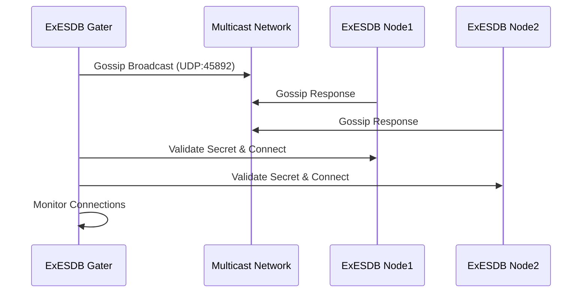

# Getting Started with ExESDB Gater

ExESDB Gater is a high-availability gateway service that provides secure, load-balanced access to ExESDB clusters. This guide will walk you through setting up and using ExESDB Gater in both development and production environments.

## Table of Contents

- [Prerequisites](#prerequisites)
- [Quick Start](#quick-start)
- [Development Setup](#development-setup)
- [Configuration](#configuration)
- [Cluster Discovery](#cluster-discovery)
- [API Usage](#api-usage)
- [Monitoring and Troubleshooting](#monitoring-and-troubleshooting)
- [Production Deployment](#production-deployment)
- [Best Practices](#best-practices)

## Prerequisites

### System Requirements

- **Elixir**: 1.14+
- **Erlang/OTP**: 25+
- **Docker**: 20.10+ (for containerized deployment)
- **Docker Compose**: 3.8+

### ExESDB Cluster

ExESDB Gater requires a running ExESDB cluster to connect to. Make sure you have:

1. An operational ExESDB cluster
2. Shared network connectivity (e.g., Docker bridge network)
3. Matching cluster secrets and cookies
4. LibCluster gossip multicast enabled

## Quick Start

### 1. Clone and Setup

```bash
git clone https://github.com/beam-campus/ex-esdb-gater.git
cd ex-esdb-gater
```

### 2. Start with Docker Compose (Recommended)

The fastest way to get started is using the provided development environment:

```bash
cd dev-env
./gater-manager.sh
```

This will launch an interactive menu where you can:

- Start ExESDB Gater
- Start development tools (Livebook, Excalidraw)
- Monitor cluster connectivity
- View logs and resource usage

### 3. Manual Docker Compose

If you prefer manual control:

```bash
cd dev-env

# Start ExESDB Gater
docker-compose \
  -f ex-esdb-network.yaml \
  -f ex-esdb-gater.yaml \
  -f ex-esdb-gater-override.yaml \
  --profile gater \
  -p gater \
  up -d
```

### 4. Verify Installation

Check that ExESDB Gater is running and connected to the cluster:

```bash
# Check container status
docker ps | grep gater

# Check cluster connectivity
docker exec ex-esdb-gater /bin/sh -c "echo 'Node.list().' | /opt/ex_esdb_gater/bin/ex_esdb_gater rpc"

# View logs
docker logs ex-esdb-gater -f
```

## Development Setup

### Local Development Environment

For local development without Docker:

```bash
cd system

# Install dependencies
mix deps.get

# Compile the project
mix compile

# Start in development mode
iex -S mix
```

### Environment Configuration

Create a `.env` file or set environment variables:

```bash
# Cluster configuration
export EX_ESDB_CLUSTER_SECRET="your_cluster_secret"
export EX_ESDB_COOKIE="your_cluster_cookie"
export RELEASE_COOKIE="your_cluster_cookie"

# Gateway configuration
export EX_ESDB_GATER_CONNECT_TO="target_node@hostname"
export EX_ESDB_PUB_SUB="ex_esdb_pubsub"

# Logging
export LOG_LEVEL="debug"
```

### Development Tools

The development environment includes useful tools:

- **Livebook**: Interactive notebooks for experimentation
  - Access: http://localhost:8080
- **Excalidraw**: Diagramming and visualization
  - Access: http://localhost:8081

Start tools with:

```bash
cd dev-env
./gater-manager.sh
# Choose option [2] or [a] to start tools
```

## Configuration

### Basic Configuration

ExESDB Gater configuration is handled through environment variables and Elixir configuration files.

#### Environment Variables

| Variable                 | Description                   | Default           |
| ------------------------ | ----------------------------- | ----------------- |
| `EX_ESDB_PUB_SUB`        | PubSub process name           | `:ex_esdb_pubsub` |
| `EX_ESDB_CLUSTER_SECRET` | Cluster authentication secret | -                 |
| `EX_ESDB_COOKIE`         | Erlang distribution cookie    | -                 |
| `RELEASE_COOKIE`         | Release distribution cookie   | -                 |
| `LOG_LEVEL`              | Logging level                 | `"info"`          |

#### LibCluster Configuration

Edit `config/runtime.exs` to customize cluster discovery:

```elixir
config :libcluster,
  topologies: [
    ex_esdb_gater: [
      strategy: Cluster.Strategy.Gossip,
      config: [
        port: 45_892,
        if_addr: "0.0.0.0",
        multicast_addr: "255.255.255.255",
        broadcast_only: true,
        secret: System.get_env("EX_ESDB_CLUSTER_SECRET")
      ]
    ]
  ]
```

### Advanced Configuration

#### Custom PubSub Configuration

```elixir
config :ex_esdb_gater, :api,
  connect_to: node(),
  pub_sub: :my_custom_pubsub
```

#### Network Configuration

For custom network setups, modify the Docker network configuration:

```yaml
# ex-esdb-network.yaml
networks:
  ex-esdb-net:
    driver: bridge
    ipam:
      config:
        - subnet: 172.20.0.0/16
```

## Cluster Discovery

### How It Works

ExESDB Gater uses LibCluster with Gossip strategy for automatic cluster discovery:

1. **Initialization**: ExESDB Gater starts and initializes LibCluster
2. **Broadcast**: Sends gossip broadcasts on multicast network
3. **Discovery**: Listens for ExESDB node advertisements
4. **Authentication**: Validates cluster membership using shared secrets
5. **Connection**: Establishes Erlang distribution connections
6. **Monitoring**: Continuously monitors cluster health

### Cluster Formation Process



### Troubleshooting Discovery

#### Common Issues

1. **Network Connectivity**

   ```bash
   # Test multicast connectivity
   docker exec ex-esdb-gater ping 255.255.255.255

   # Check gossip port
   docker exec ex-esdb-gater netstat -ln | grep 45892
   ```

2. **Secret Mismatch**

   ```bash
   # Verify environment variables match
   docker exec ex-esdb-gater env | grep SECRET
   docker exec ex-esdb0 env | grep SECRET
   ```

3. **Cookie Issues**
   ```bash
   # Check distribution cookies
   docker exec ex-esdb-gater cat /opt/ex_esdb_gater/releases/*/releases.exs
   ```

## API Usage

### Basic Operations

Once ExESDB Gater is connected to the cluster, you can use its API for event store operations:

#### Append Events

```elixir
# Append events to a stream
events = [
  %{event_type: "UserCreated", data: %{id: 1, name: "John"}},
  %{event_type: "UserUpdated", data: %{id: 1, email: "john@example.com"}}
]

{:ok, new_version} = ExESDBGater.API.append_events(:my_store, "user-1", events)
```

#### Read Events

```elixir
# Read events from a stream
{:ok, events} = ExESDBGater.API.get_events(:my_store, "user-1", 0, 10, :forward)

# Get stream version
{:ok, version} = ExESDBGater.API.get_version(:my_store, "user-1")

# List all streams
{:ok, streams} = ExESDBGater.API.get_streams(:my_store)
```

#### Subscriptions

```elixir
# Create a persistent subscription
ExESDBGater.API.save_subscription(
  :my_store,
  :by_stream,
  "user-1",
  "user_subscription",
  0,
  self()
)

# Create a transient subscription
ExESDBGater.API.save_subscription(
  :my_store,
  :by_event_type,
  "UserCreated"
)

# Remove subscription
ExESDBGater.API.remove_subscription(
  :my_store,
  :by_stream,
  "user-1",
  "user_subscription"
)
```

#### Snapshots

```elixir
# Record a snapshot
ExESDBGater.API.record_snapshot(
  :my_store,
  "source-uuid",
  "stream-uuid",
  5,
  %{state: "current_aggregate_state"}
)

# Read a snapshot
{:ok, snapshot} = ExESDBGater.API.read_snapshot(
  :my_store,
  "source-uuid",
  "stream-uuid",
  5
)

# List snapshots
{:ok, snapshots} = ExESDBGater.API.list_snapshots(:my_store)
```

### Error Handling

Always handle potential errors in your API calls:

```elixir
case ExESDBGater.API.append_events(:my_store, "stream", events) do
  {:ok, version} ->
    Logger.info("Events appended, new version: #{version}")

  {:error, :timeout} ->
    Logger.error("Request timed out")

  {:error, :no_workers} ->
    Logger.error("No gateway workers available")

  {:error, reason} ->
    Logger.error("Append failed: #{inspect(reason)}")
end
```

## Monitoring and Troubleshooting

### Health Monitoring

#### Container Health

```bash
# Check container health
docker ps | grep gater

# Detailed container inspection
docker inspect ex-esdb-gater | jq '.[0].State.Health'

# Resource usage
docker stats ex-esdb-gater
```

#### Cluster Connectivity

```bash
# Check connected nodes
docker exec ex-esdb-gater /bin/sh -c "echo 'Node.list().' | /opt/ex_esdb_gater/bin/ex_esdb_gater rpc"

# Check cluster monitor logs
docker logs ex-esdb-gater | grep -i "cluster\|libcluster"
```

### Log Analysis

#### Application Logs

```bash
# Real-time logs
docker logs ex-esdb-gater -f

# Filter for specific components
docker logs ex-esdb-gater 2>&1 | grep -E "(ClusterMonitor|LibCluster|API)"

# Error logs only
docker logs ex-esdb-gater 2>&1 | grep -i error
```

#### Structured Log Analysis

ExESDB Gater provides structured logging with color-coded themes:

- 🔗 **ClusterMonitor**: Node connection events
- 🚪 **API**: Gateway API operations
- 🏭 **System**: Supervisor and system events

### Common Issues and Solutions

#### Issue: ExESDB Gater not discovering ExESDB nodes

**Symptoms**: Empty node list, no cluster connections

**Solutions**:

1. Verify network connectivity:

   ```bash
   docker network ls | grep ex-esdb-net
   ```

2. Check gossip configuration:

   ```bash
   docker exec ex-esdb-gater env | grep -E "(GOSSIP|CLUSTER)"
   ```

3. Verify cluster secrets match:

   ```bash
   # Check ExESDB Gater secret
   docker exec ex-esdb-gater env | grep CLUSTER_SECRET

   # Check ExESDB secret
   docker exec ex-esdb0 env | grep CLUSTER_SECRET
   ```

#### Issue: Gateway workers not available

**Symptoms**: `{:error, :no_workers}` responses

**Solutions**:

1. Check Swarm registration:

   ```elixir
   # In ExESDB Gater console
   Swarm.registered() |> Enum.filter(fn {name, _} -> match?({:gateway_worker, _, _}, name) end)
   ```

2. Restart ExESDB Gater:
   ```bash
   cd dev-env
   ./gater-manager.sh
   # Choose [r1] to restart
   ```

#### Issue: Connection timeouts

**Symptoms**: Slow responses, timeout errors

**Solutions**:

1. Check cluster health:

   ```bash
   docker exec ex-esdb0 /bin/sh -c "echo ':ra_leaderboard.lookup_leader(:my_store).' | /opt/ex_esdb/bin/ex_esdb rpc"
   ```

2. Monitor resource usage:
   ```bash
   docker stats --format "table {{.Container}}\t{{.CPUPerc}}\t{{.MemUsage}}"
   ```

## Production Deployment

### Container Orchestration

#### Docker Swarm

```yaml
# docker-compose.prod.yml
version: "3.8"

services:
  ex-esdb-gater:
    image: local/ex-esdb-gater:latest
    environment:
      EX_ESDB_CLUSTER_SECRET: ${CLUSTER_SECRET}
      EX_ESDB_COOKIE: ${CLUSTER_COOKIE}
      RELEASE_COOKIE: ${CLUSTER_COOKIE}
      LOG_LEVEL: "info"
    networks:
      - ex-esdb-net
    deploy:
      replicas: 3
      resources:
        limits:
          memory: 512M
          cpus: "0.5"
        reservations:
          memory: 256M
          cpus: "0.25"
      restart_policy:
        condition: on-failure
        delay: 5s
        max_attempts: 3
```

#### Kubernetes

```yaml
# k8s/deployment.yaml
apiVersion: apps/v1
kind: Deployment
metadata:
  name: ex-esdb-gater
  labels:
    app: ex-esdb-gater
spec:
  replicas: 3
  selector:
    matchLabels:
      app: ex-esdb-gater
  template:
    metadata:
      labels:
        app: ex-esdb-gater
    spec:
      containers:
        - name: ex-esdb-gater
          image: local/ex-esdb-gater:latest
          env:
            - name: EX_ESDB_CLUSTER_SECRET
              valueFrom:
                secretKeyRef:
                  name: cluster-secrets
                  key: cluster-secret
            - name: EX_ESDB_COOKIE
              valueFrom:
                secretKeyRef:
                  name: cluster-secrets
                  key: cluster-cookie
            - name: RELEASE_COOKIE
              valueFrom:
                secretKeyRef:
                  name: cluster-secrets
                  key: cluster-cookie
          resources:
            limits:
              memory: "512Mi"
              cpu: "500m"
            requests:
              memory: "256Mi"
              cpu: "250m"
          livenessProbe:
            exec:
              command:
                - /bin/sh
                - -c
                - echo 'Node.alive?().' | /opt/ex_esdb_gater/bin/ex_esdb_gater rpc
            initialDelaySeconds: 30
            periodSeconds: 10
          readinessProbe:
            exec:
              command:
                - /bin/sh
                - -c
                - echo 'length(Node.list()) > 0.' | /opt/ex_esdb_gater/bin/ex_esdb_gater rpc
            initialDelaySeconds: 15
            periodSeconds: 5
```

### Security Considerations

#### Network Security

1. **Firewall Rules**: Restrict gossip port (45892) access
2. **Network Segmentation**: Use dedicated networks for cluster communication
3. **TLS**: Enable TLS for production Erlang distribution

#### Secrets Management

1. **Environment Variables**: Never hardcode secrets
2. **Secret Stores**: Use Kubernetes secrets, Docker secrets, or external secret managers
3. **Rotation**: Implement regular secret rotation procedures

#### Access Control

1. **API Gateway**: Place ExESDB Gater behind an API gateway
2. **Authentication**: Implement proper authentication for client applications
3. **Authorization**: Control access to specific streams and operations

### Performance Tuning

#### Resource Allocation

- **Memory**: 256MB-512MB per instance depending on load
- **CPU**: 0.25-0.5 cores per instance
- **Network**: Ensure sufficient bandwidth for cluster communication

#### Scaling Guidelines

- **Horizontal Scaling**: Add more ExESDB Gater instances for higher throughput
- **Load Balancing**: Use external load balancers for client requests
- **Monitoring**: Implement comprehensive monitoring and alerting

## Best Practices

### Development

1. **Environment Isolation**: Use separate environments for development, staging, and production
2. **Configuration Management**: Use environment-specific configuration files
3. **Testing**: Implement comprehensive integration tests with cluster scenarios
4. **Documentation**: Document custom configuration and deployment procedures

### Operations

1. **Monitoring**: Implement comprehensive monitoring for all components
2. **Logging**: Use structured logging with proper log levels
3. **Alerting**: Set up alerts for cluster connectivity issues
4. **Backup**: Ensure ExESDB cluster has proper backup procedures

### Security

1. **Secrets**: Use proper secret management for cluster credentials
2. **Network**: Implement network-level security controls
3. **Updates**: Keep ExESDB Gater and dependencies updated
4. **Auditing**: Log and audit all administrative operations

### Performance

1. **Resource Monitoring**: Monitor CPU, memory, and network usage
2. **Load Testing**: Perform regular load testing to identify bottlenecks
3. **Capacity Planning**: Plan for growth and scale proactively
4. **Optimization**: Profile and optimize hot code paths

## Next Steps

Now that you have ExESDB Gater up and running:

1. **Explore the API**: Try different event store operations
2. **Set up Monitoring**: Implement proper monitoring and alerting
3. **Build Applications**: Integrate ExESDB Gater into your event-sourced applications
4. **Scale**: Deploy multiple ExESDB Gater instances for high availability
5. **Contribute**: Consider contributing improvements back to the project

For more information, see:

- [ExESDB Documentation](../../ex-esdb/system/guides/getting-started.md)
- [LibCluster Documentation](https://hexdocs.pm/libcluster/)
- [Elixir Release Documentation](https://hexdocs.pm/mix/Mix.Tasks.Release.html)

## Support

If you encounter issues:

1. Check the [troubleshooting section](#monitoring-and-troubleshooting)
2. Review the logs for error messages
3. Verify your configuration matches the examples
4. Test network connectivity between components
5. Open an issue on the project repository with detailed information
